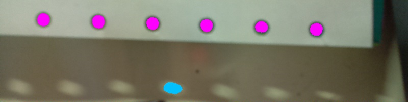

FireSight
=========

FireSight is a factory that builds an OpenCV image processing pipeline from a declarative pipeline specfication.
When processed, the pipeline transforms an optional input image and 
returns a recognized data model with information recognized during each pipeline stage. Both pipeline specification and data model are represented using the JSON data format, which is easy to generate and parse. 

Intended for pick-and-place vision recognition, FireSight provides the power of OpenCV in an easy to use JSON format.
FireSight lets users customize their vision recognition solutions with minimal effort. FireSight also provides a scriptable command line utility that permit quick exploration of alternate pipeline implementations. 

FireSight is available as a C++ library as well as a standalone runtime under the MIT license. It has been tested on:

* Raspbian (Raspberry Pi Debian)
* ChromeBook Pixel (Crouton+Ubuntu)
* Windows 7 Professional ThinkPad T410

### Installation

* [Build FireSight (Linux)](https://github.com/firepick1/FireSight/wiki/Build-FireSight-%28Linux%29)
* [Build FireSight (Windows)](https://github.com/firepick1/FireSight/wiki/Build-FireSight-%28Linux%29)

### Examples
Recognize holes in <a href="img/cam.jpg">cam.jpg</a>:
<pre>
firesight -p json/pipeline0.json -i img/cam.jpg
</pre>

The <code>-p pipeline0.json</code> argument identifies the [JSON pipeline configuration](http://github.com/firepick1/FireSight/wiki). In this case,
the pipeline consists of two stages (named "s1" and "s2"). The first stage recognizes holes within
the given range of diameters. The second writes the working image to "pipeline0.jpg":
<pre>
[
	{"name":"s1", "op":"HoleRecognizer", "diamMin":22.6, "diamMax":29.9, "show":1},
	{"name":"s2", "op":"imwrite", "path":"target/pipeline0.jpg"}
]
</pre>

The <code>-i cam.jpg</code> argument specifies the image to process. 
This parameter is optional but may prove useful. Alternatively, 
the pipeline itself can use <code>imread</code> to load an image.

The pipeline returns a JSON model representing the information recognized at each pipeline stage:

<pre>
{
  "s1":{
    "holes":[
      {
        "xmin":608,
        "xmax":632,
        "xavg":619.8985595703125,
        "ymin":45,
        "ymax":69,
        "yavg":57.265720367431641,
        "pts":493,
        "ellipse":490.87387084960938,
        "covar":0.671875
      },
      {
        "xmin":180,
        "xmax":205,
        "xavg":192.58755493164062,
        "ymin":30,
        "ymax":55,
        "yavg":42.214008331298828,
        "pts":514,
        "ellipse":530.92919921875,
        "covar":1.3974609375
      },
      {
        "xmin":287,
        "xmax":311,
        "xavg":298.81341552734375,
        "ymin":34,
        "ymax":58,
        "yavg":45.660377502441406,
        "pts":477,
        "ellipse":490.87387084960938,
        "covar":0.8798828125
      },
      {
        "xmin":500,
        "xmax":525,
        "xavg":512.39361572265625,
        "ymin":41,
        "ymax":64,
        "yavg":52.455375671386719,
        "pts":437,
        "ellipse":490.08847045898438,
        "covar":0.82421875
      },
      {
        "xmin":393,
        "xmax":417,
        "xavg":404.7484130859375,
        "ymin":38,
        "ymax":62,
        "yavg":49.585624694824219,
        "pts":473,
        "ellipse":490.87387084960938,
        "covar":0.89453125
      },
      {
        "xmin":73,
        "xmax":97,
        "xavg":84.7353515625,
        "ymin":26,
        "ymax":51,
        "yavg":38.303031921386719,
        "pts":495,
        "ellipse":510.50881958007812,
        "covar":0.045166015625
      }
    ]
  },
  "s2":{
    "result":true
  }
}
</pre>

